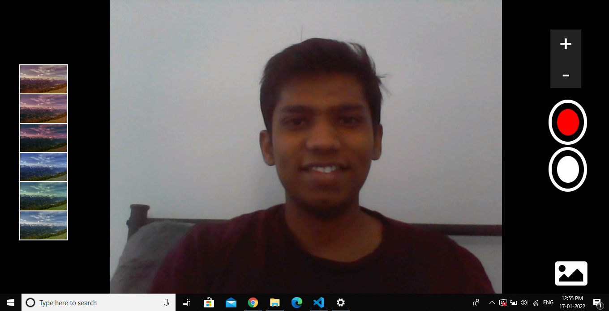
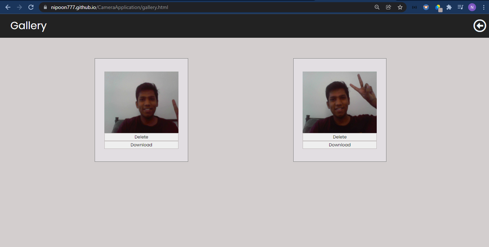

# CameraApplication

# Live Site link:
  https://nipoon777.github.io/CameraApplication/
  
# Description

  The web application has the features of the traditional Web Camera on a laptop/mobile device. The same application is extended over a web browser.
  The Camera application stores the images clicked onto the indexedDB storage of the web browser. In this way the pictures clicked will be stored even when the browser is closed
  The application is built by just using Javascript, HTML, CSS from scratch without using any External API's or storage.

# Features

- The User can zoom in and out of images which is not possible on traditional desktop camera.
- This feature is implemented using the canvas node of HTML document. Wherein we manipulate the data using scaling functions of Canvas API
- Applying filters to the images
- Gallery to download or delete the images

